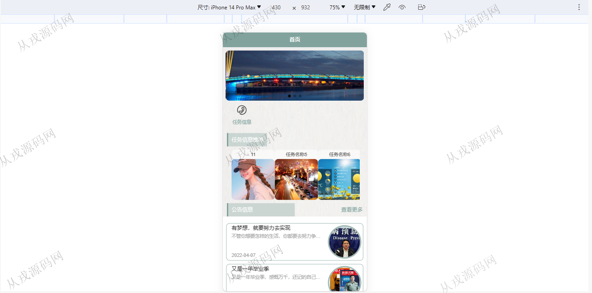
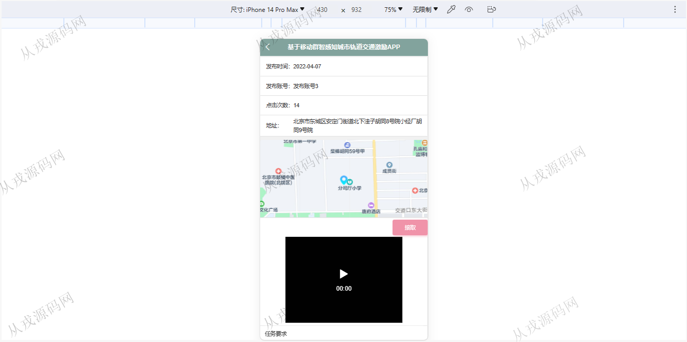
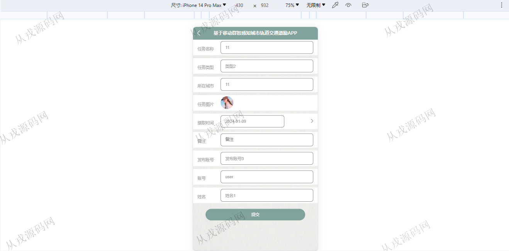
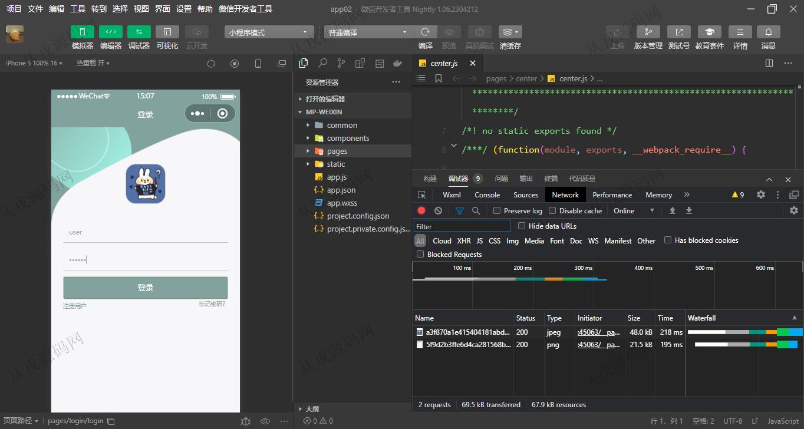
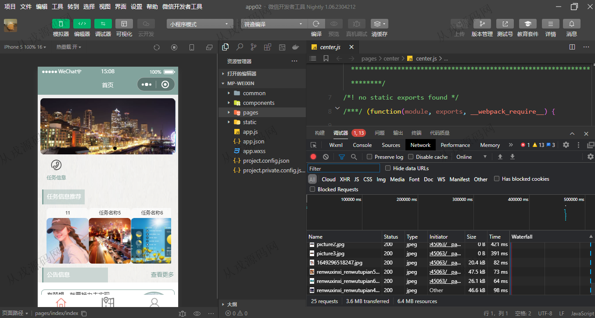
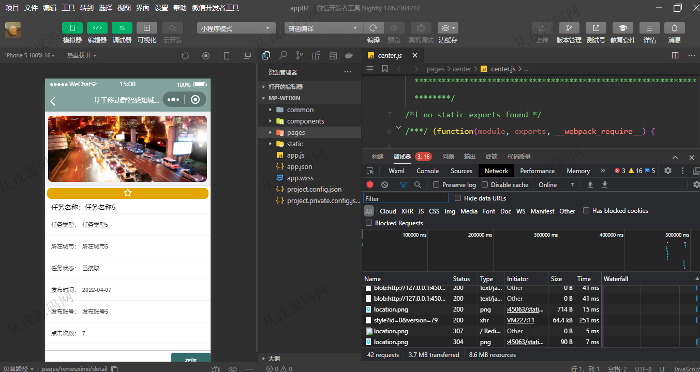
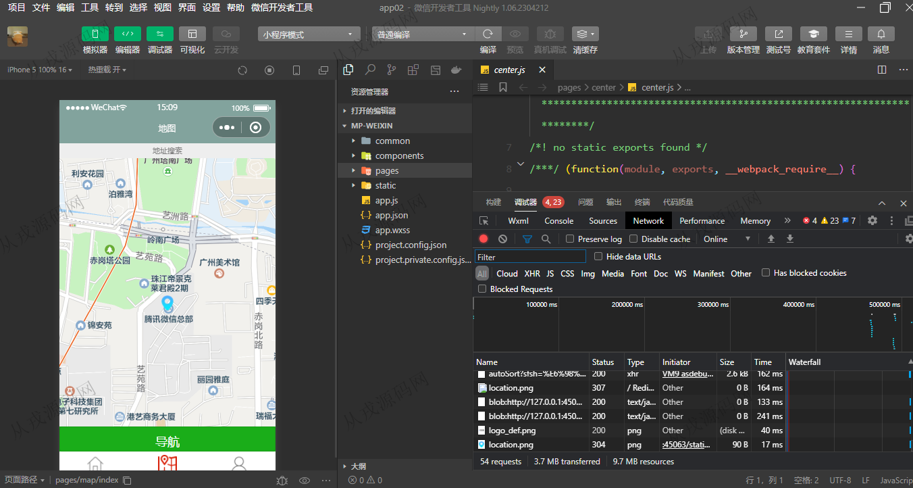
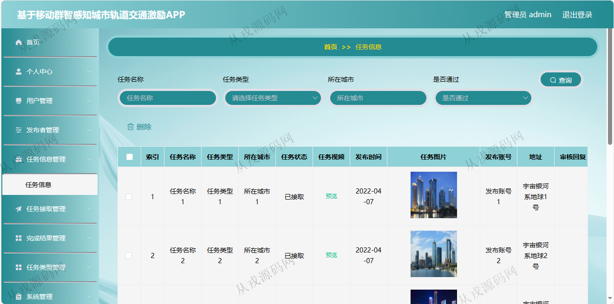
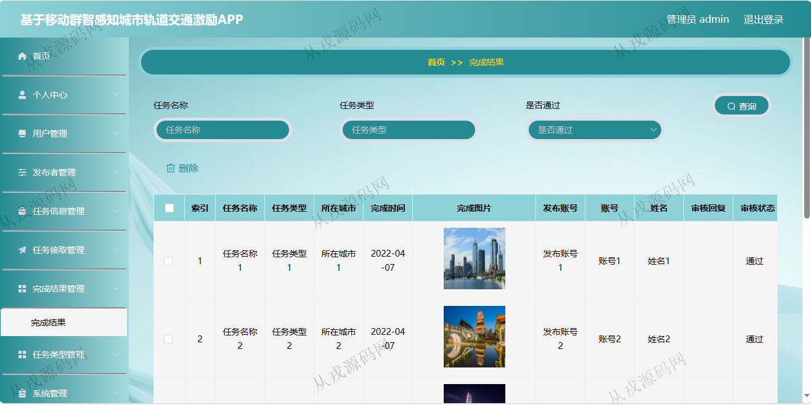

<h1 align="center">127.城市轨道交通激励APP管理系统</h1>

- <b>完整代码获取地址：从戎源码网 ([https://armycodes.com/](https://armycodes.com/))</b>
- <b>技术探讨、资料分享，请加QQ群：692619798</b> 
- <b>作者微信：19941326836  QQ：952045282</b> 
- <b>承接计算机毕业设计、Java毕业设计、Python毕业设计、深度学习、机器学习</b>
- <b>选题+开题报告+任务书+程序定制+安装调试+论文+答辩ppt 一条龙服务</b>
- <b>所有选题地址 ([https://github.com/YuLin-Coder/AllProjectCatalog](https://github.com/YuLin-Coder/AllProjectCatalog)) </b>

## 项目介绍
基于uniapp的城市轨道交通激励管理系统：前端 vue、elementui、小程序、h5，后端 maven、springmvc、spring、mybatis，角色分为管理员、用户；集成任务浏览，任务接取，任务信息管理等功能于一体的系统。

## 功能介绍

### 用户

- 用户两端功能：用户端分为uniapp实现的小程序，手机网页版h5页面
- 基本功能：登录、注册、退出
- 用户端首页：轮播图，任务信息推荐，公告信息
- 任务：任务浏览，任务详情，任务接取，任务中地图位置显示，视频播放
- 导航：地图定位，路线导航
- 我的：任务接取列表，完成结果列表，我的收藏

### 管理员

- 个人中心：个人信息查看与修改，密码修改
- 用户管理：用户信息的增删改查，头像上传
- 发布者管理：发布者信息的增删改查
- 任务信息管理：任务信息的增删改查，任务审核，查看评论
- 完成结果管理：完成结果的列表查询，详情，删除
- 任务类型管理：任务类型信息的增删改查

## 环境

- <b>IntelliJ IDEA 2021.3</b>

- <b>Mysql 5.7.26</b>

- <b>Tomcat 7.0.73</b>

- <b>JDK 1.8</b>

- <b>HBuilderX </b>

## 运行截图

